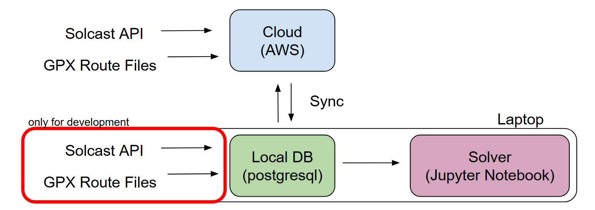

# MSXVI - FSGP & ASC Strategy
## About
This repository contains the work of the Midnight Sun Strategy team, including code for setting up and interacting with a database, a simulator, and MPC.

## FSGP & ASC
FSGP serves as a qualifying event for ASC. 

    Scoring is based on the highest overall official distance driven or laps completed over the duration of the event with ties being broken by the lowest overall official elapsed time or fastest lap" in other words maximising distance for a fixed time. 

If qualified, the objectives of ASC are the following:

    1. To complete the American Solar Challenge base route without trailering.
    2. To complete as many official miles as possible. (1st Tiebreaker)
    3. To complete the distance in the shortest elapsed time. (2nd Tiebreaker)

Successfully achieving these objectives hinges on two factors: 
- designing an efficient solar car (less power out)
- following an optimal race strategy

Race strategy boils down to a single question:

### **What speed should we drive at to maximize distance within race constraints?**

We address this question by leveraging the route, weather, and solar irradiance data. 

## Route Overview

Run *overview.py* to get distance, elevation profile, and irradiance data for a given stage.

## Database

The database is comprised of two tables: the route model and a solar irradiance table.*routemodel.py* parses the route files (.gpx) to generate a table. *irradiance.py* parses live online data (solcast.com), historical data (from solcast.com), or symthetic data to generate a table. 

The database can run offline locally (*loader.py*) and can be synced (*sync.py*) with a cloud instance based on the availability of wifi. 

## Simulator

*simulation.py* consists of a solver which computes the instantaneous power draw and supply from multiple sources over the course of a stage:

- **Drag Resistance**: based on vehicle aerodynamics, wind and velocity.
- **Rolling Resistance**: determined by the surface conditions of the road, mass of the car, and velocity.
- **Gradient Resistance**: determined by slope of the road and velocity.
- **Solar Irradiance**: determined by solar irradiance, vehicle orientation, array efficiency, and velocity.

## MPC

In progress.

## Todo
- refactor db/
- mpc.py
- README